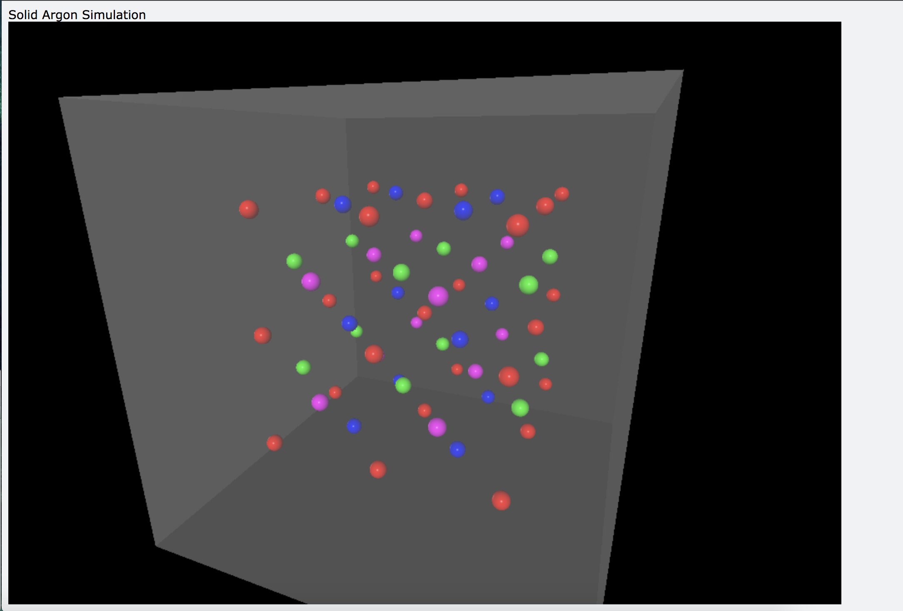
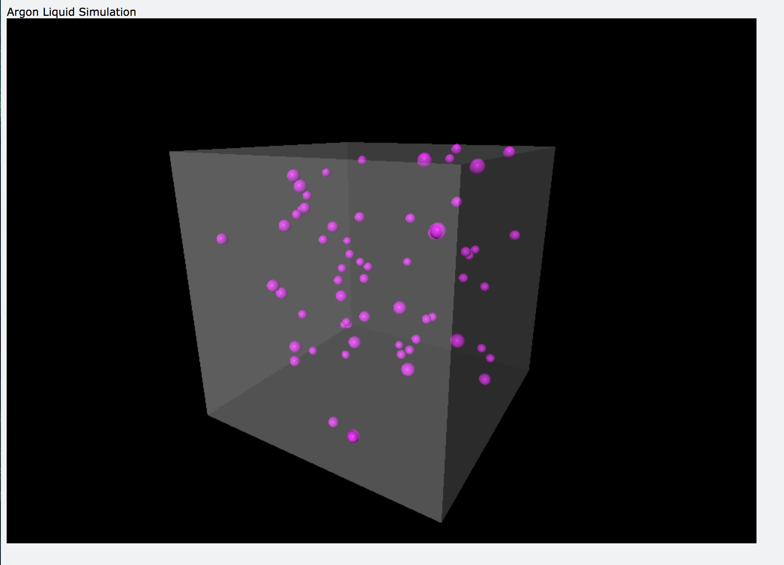
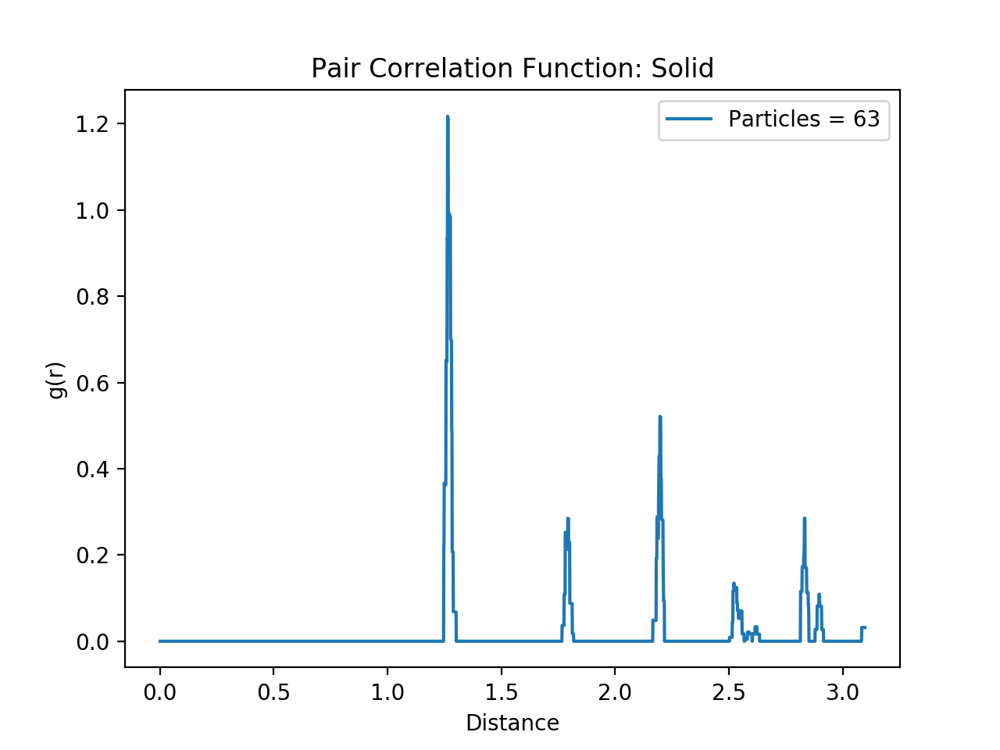
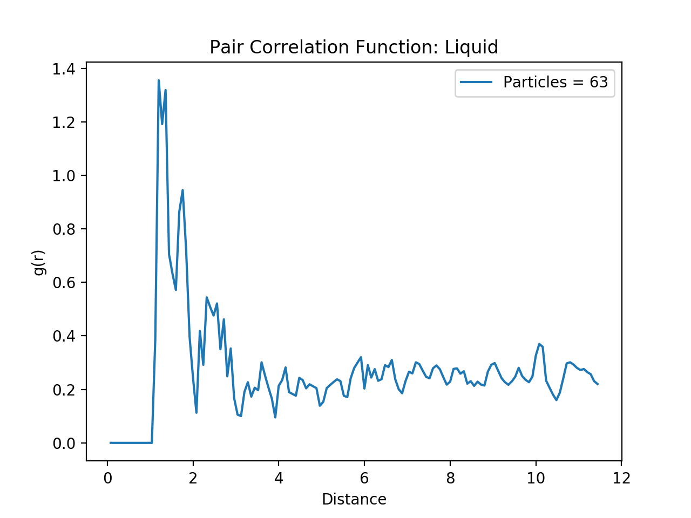

# Simulating Solid/Liquid Argon using MC methods
This repo contains the code base to create a 2 and 3D simulation of solid and liquid argon.
Specific indicators that measure the properties of the materials such as pair correlation function and mean square distance are in the /images folder.

This code has become a work in progress recently and has undergone major structural as well as coding practice changes.

A sample simulation where particles move freely in the liquid state can be run by
```
# Runs a simulation of Argon atoms in a liquid state
python scripts/simulate.py

```

# Solid and Liquid Argon still shots

| Solid Argon           | Liquid Argon           |
|--------------------|--------------------|
|  |  |


# Material Properties

| Solid Argon           | Liquid Argon           |
|--------------------|--------------------|
|  |  |